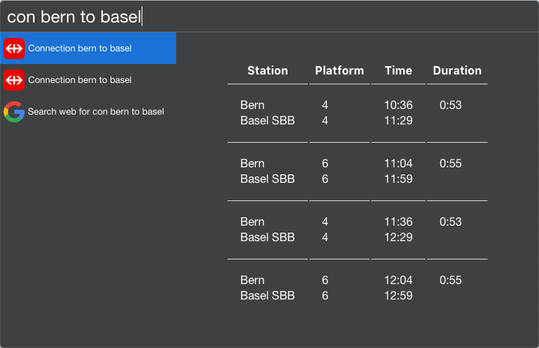

# Cerebro-connection

> Simple access to the SBB/CFF/FFS timetable service plugin for cerebro app

## Usage

In Cerebro, type for example `con bern to basel`

## Related

* [Cerebro](http://github.com/KELiON/cerebro) – Plugin extracted from core Cerebro app;
* [cerebro-plugin](http://github.com/KELiON/cerebro-plugin) – boilerplate to create Cerebro plugins;